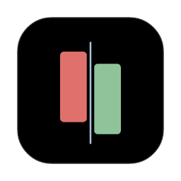

<p align="center">
  
</p>

<h1 align="center">Kerf</h1>

<p align="center">
  <b>The cut between two branches — or any two texts.</b><br>
  A fast, native, keyboard-first diff tool built in Rust on <a href="https://www.gpui.rs/">GPUI</a> (Zed's GPU UI framework).
</p>

---

> **Kerf** /kɜːf/ — the slit a saw blade leaves behind. The icon is exactly that: two sides, offset by their difference, cut apart by a hairline.

## What it does

**Git branch diffs** (read-only — Kerf never writes to your repo)
- Open any local repo (`kerf <path>`, ⌘O, the titlebar switcher, or Recent)
- Pick **Base** and **Compare**: branches, remotes, tags, **any commit** (SHA prefix, message search, or `HEAD~3`)
- **PR Merge View** (`base...compare`) — only what compare adds, like a GitHub PR · **Compare View** (`base..compare`) — full tip-to-tip difference. Press **?** in the app for a visual explainer
- **Files** tab (tree / list, search, rename %, viewed ticks) and **Commits** tab (ahead / behind, set any commit as base / compare with `b` / `c`)
- Unified or split, word-level highlights, syntax colour, fixed gutters, horizontal scroll, **wrap**, draggable split divider, change minimap, **tabs**
- Built for big diffs: background work, virtualized rows, 100k-line file in ~150 ms, 20 MB gate, lockfiles collapsed

**Plain diffs** (no git needed)
- **New Diff** — a live side-by-side diff editor (like Meld / VS Code's diff editor): type or paste on both sides, the diff updates as you type, filler rows keep lines aligned, one scroll moves both sides
- **Compare Files** or `kerf a.txt b.txt` — the same editable view for two files. Nothing is written to disk

**Everything else**
- Multiple windows (⌘⇧N) · start page · Black Metal dark theme · JetBrains Mono
- Every shortcut in one place: click **Shortcuts** in the status bar

## Install

Download from [Releases](https://github.com/noorshikalgar/kerf/releases).

**macOS** (Apple Silicon + Intel): `Kerf-<version>-macos-universal.zip` → unzip → move **Kerf.app** to Applications. The app is ad-hoc signed, not notarized, so the first launch needs right-click → **Open**, or:

```bash
xattr -dr com.apple.quarantine /Applications/Kerf.app
```

Optional CLI:

```bash
ln -sf /Applications/Kerf.app/Contents/MacOS/kerf /usr/local/bin/kerf
```

**Linux** (x86_64, experimental): `Kerf-<version>-linux-x86_64.tar.gz` → installs to `~/.local` (binary, desktop entry, icons):

```bash
tar xzf Kerf-*-linux-x86_64.tar.gz && ./Kerf-*/install.sh
```

**Windows** (x86_64, experimental): `Kerf-<version>-windows-x86_64.zip` → unzip → run `kerf.exe`. Not code-signed yet: SmartScreen may warn → **More info → Run anyway**.

Linux and Windows builds pass the full automated test suite on CI but haven't been visually checked yet — issues welcome. Shortcuts use **Ctrl** where macOS uses **⌘**, and follow each platform's editing conventions (e.g. Ctrl+←/→ by word, Home/End).

## Build from source

Requires Rust 1.85+. macOS 12+: GPUI is built with `runtime_shaders`, so the Xcode Metal toolchain is not needed. Linux needs a few system libraries:

```bash
sudo apt install gcc g++ pkg-config libasound2-dev libfontconfig-dev libwayland-dev libx11-xcb-dev libxkbcommon-x11-dev libvulkan-dev libzstd-dev libssl-dev
```

```bash
cargo run --release -- ~/path/to/repo
```

```bash
cargo run --release -- old.txt new.txt
```

Package like the release does: `scripts/bundle-macos.sh` (Kerf.app + zip), `scripts/bundle-linux.sh` (tar.gz), `scripts/bundle-windows.ps1` (zip).

## Tests

```bash
cargo test
```

```bash
cargo test --release --test perf -- --ignored --nocapture
```

## Icon

The mark lives in [`assets/icon/`](assets/icon/): `kerf.svg` is the master, and `examples/icon.rs` renders every macOS size into an iconset (the hairline is re-drawn thicker at 16 and 32 px so the cut stays visible).

```bash
cargo run --example icon
```

## Docs

Planning and design docs are in [`docs/`](docs/): PRD, UI/UX PRD, style guide (Black Metal), architecture, workflow.

## License

MIT
